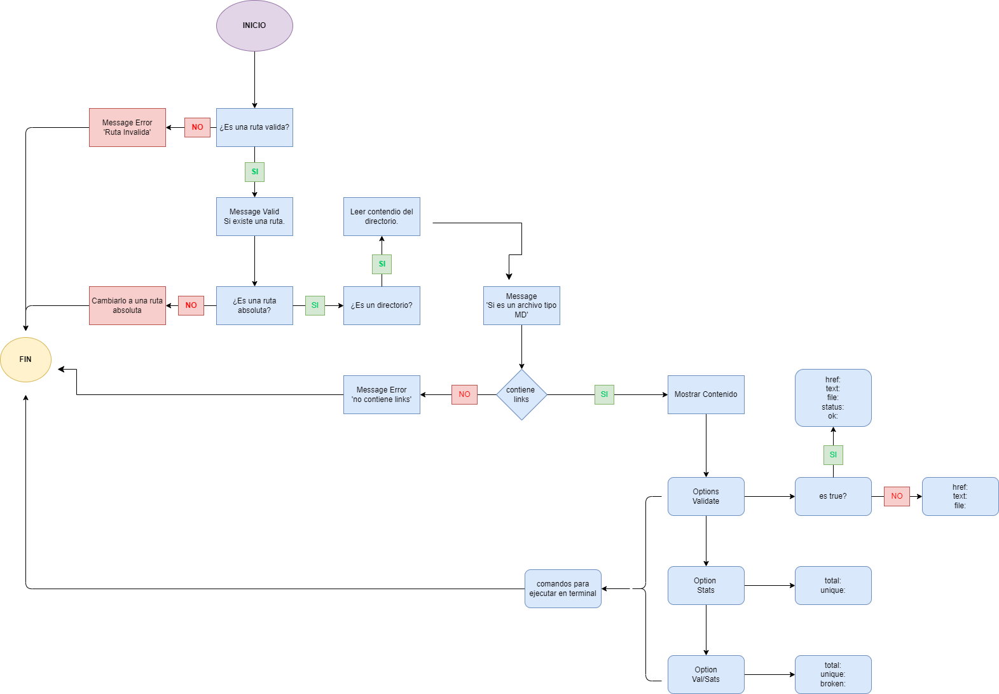

Markdown Links

¿Que es Markdown? es un lenguaje de marcado ligero muy popular entre developers. Es usado en muchísimas plataformas que manejan texto plano (GitHub, foros, blogs, ...) y es muy común encontrar varios archivos en ese formato en cualquier tipo de repositorio (empezando por el tradicional README.md).

Estos archivos Markdown normalmente contienen links (vínculos/ligas) que muchas veces están rotos o ya no son válidos y eso perjudica mucho el valor de la información que se quiere compartir.

Dentro de una comunidad de código abierto, nos han propuesto crear una herramienta usando Node.js, que lea y analice archivos en formato Markdown, para verificar los links que contengan y reportar algunas estadísticas.

Markdown

2. Resumen del proyecto
En este proyecto se creó una herramienta de línea de comando (CLI) o librería que lee y analiza archivos en formato Markdown, el cual verifica el estado de los links (--validate) y refleja algunas estadisticas (--stats), esto ejecutando ciertos comandos en la terminal para su funcionamiento.

3. Diagrama de Flujo
Con este diagrama de flujo lo que se busca es hacer más fácil el entendimiento del proyecto:

Diagrama de Flujo

4. Instalación y comandos
Para realizar la instalación tenemos dos opciones de comandos a utilizar en la terminal, luego de haber inicializado el proyecto con npm init:

npm i md-links-danielarocha
o

npm i https://github.com/DanielaRo

5. Funcionalidad
1) Archivos
Dentro del proyecto se encuentran los siguientes archivos:

cli.js: Aquí se encuentra la línea de comandos para ser ejecutado por la terminal.
index.js: Aquí se almacena la función mdLinks la cual nos retorna una nueva promesa en un array de objetos.
functions.js: Aquí se encuentran las funciones que nos ayudan con la creación de la funcion mdLinks.
Este módulo se puede importar en otros scripts de Node.js y ofrece la siguiente interfaz:

mdLinks(path, options)
Argumentos
path: Ruta absoluta o relativa al archivo o directorio. Si la ruta pasada es relativa, debe resolverse como relativa al directorio desde donde se invoca node - current working directory).
options: Un objeto con únicamente la siguiente propiedad:
validate: Booleano que determina si se desea validar los links encontrados.
Valor de retorno
La función retorna una promesa (Promise) que resuelva a un arreglo (Array) de objetos (Object), donde cada objeto representa un link y contiene las siguientes propiedades:

Con validate:false :

href: URL encontrada.
text: Texto que aparecía dentro del link (<a>).
file: Ruta del archivo donde se encontró el link.
Con validate:true :

href: URL encontrada.
text: Texto que aparecía dentro del link (<a>).
file: Ruta del archivo donde se encontró el link.
status: Código de respuesta HTTP.
ok: Mensaje fail en caso de fallo u ok en caso de éxito.
Ejemplo (resultados como comentarios)
const mdLinks = require("md-links");

mdLinks("./some/example.md")
  .then(links => {
    // => [{ href, text, file }, ...]
  })
  .catch(console.error);

mdLinks("./some/example.md", { validate: true })
  .then(links => {
    // => [{ href, text, file, status, ok }, ...]
  })
  .catch(console.error);

mdLinks("./some/dir")
  .then(links => {
    // => [{ href, text, file }, ...]
  })
  .catch(console.error);
2) CLI (Command Line Interface - Interfaz de Línea de Comando)
El ejecutable de nuestra aplicación se puede ejecutar de la siguiente manera a través de la terminal:

md-links-danielarocha <path-to-file> [options]
Por ejemplo:

$ md-links-danielarocha ./some/example.md
./some/example.md http://algo.com/2/3/ Link a algo
./some/example.md https://otra-cosa.net/algun-doc.html algún doc
./some/example.md http://google.com/ Google
El comportamiento por defecto no debe validar si las URLs responden ok o no, solo debe identificar el archivo markdown (a partir de la ruta que recibe como argumento), analizar el archivo Markdown e imprimir los links que vaya encontrando, junto con la ruta del archivo donde aparece y el texto que hay dentro del link (truncado a 50 caracteres).

Options
--validate:
Si pasamos la opción --validate, el módulo debe hacer una petición HTTP para averiguar si el link funciona o no. Si el link resulta en una redirección a una URL que responde ok, entonces consideraremos el link como ok.

Por ejemplo:

$ md-links-danielarocha ./some/example.md --validate
./some/example.md http://algo.com/2/3/ ok 200 Link a algo
./some/example.md https://otra-cosa.net/algun-doc.html fail 404 algún doc
./some/example.md http://google.com/ ok 301 Google
Vemos que el output en este caso incluye la palabra ok o fail después de la URL, así como el status de la respuesta recibida a la petición HTTP a dicha URL.

--stats
Si pasamos la opción --stats el output (salida) será un texto con estadísticas básicas sobre los links.

$ md-links-danielarocha./some/example.md --stats
Total: 3
Unique: 3
También podemos combinar --stats y --validate para obtener estadísticas que necesiten de los resultados de la validación.

$ md-links-danielarocha ./some/example.md --stats --validate
Total: 3
Unique: 3
Broken: 1